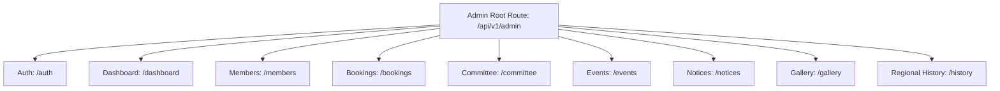

# SSPV Mandala Admin Backend API Specification

This document defines the REST API contract for the **Admin Panel** modules developed under **Milestone 5**.

All administrative endpoints are prefixed by `/api/v1/admin`.

---

## 🔒 1. Base Security & Authentication

Every route listed in this document is strictly protected by double guards:
1. **JWT Verification**: Requires a valid token in the Authorization header:
   ```http
   Authorization: Bearer <JWT_ACCESS_TOKEN>
   ```
2. **RBAC Guard (`get_admin_user`)**: Evaluates if the authenticated session holds the Role of `"admin"`. If a user with the Role `"member"` attempts to make a request, a `403 Forbidden` (`PermissionDeniedError`) is thrown.

---

## 🛣️ 2. Admin Router Tree



---

## 👥 3. Administrative Endpoints

### 1. Verification of Role
* **Endpoint**: `GET /api/v1/admin/auth/verify-role`
* **Purpose**: Simple token-validity role check prior to loading the admin panel.
* **Response Payload**:
  ```json
  {
    "verified": true,
    "role": "admin"
  }
  ```

---

### 2. Dashboard Analytics Summary
* **Endpoint**: `GET /api/v1/admin/dashboard/summary`
* **Purpose**: Retrieve aggregate statistics of platform operations.
* **Response Payload (`AdminDashboardSummary`)**:
  ```json
  {
    "total_members_count": 520,
    "verified_members_count": 480,
    "pending_bookings_count": 12,
    "upcoming_events_count": 4,
    "active_notices_count": 8,
    "gallery_images_count": 140,
    "committee_members_count": 15
  }
  ```

---

### 3. Member Directory Management
* **List All Profiles**: `GET /api/v1/admin/members`
  * *Query Params*: `verified` (Boolean, Optional) -> Filter by verification status.
  * *Response Model*: `List[MemberProfileResponse]`
* **Toggle Verification Status**: `POST /api/v1/admin/members/{id}/verify`
  * *Query Params*: `is_verified` (Boolean, Required)
  * *Response Model*: `MemberProfileResponse`
* **Soft Delete Member Profile**: `DELETE /api/v1/admin/members/{id}`
  * *Purpose*: Soft deletes the profile and all their family relatives.
  * *Response Status*: `204 No Content`

---

### 4. Booking Inquiry Auditing
* **Retrieve Platform History**: `GET /api/v1/admin/bookings/history`
  * *Purpose*: Lists all bookings across the platform. Unlike member routers, this returns financial properties.
  * *Response Model*: `List[AdminBookingResponse]`
  ```json
  [
    {
      "id": 1,
      "profile_id": 3,
      "contact_name": "System Administrator",
      "contact_phone": "9999999999",
      "booking_date": "2026-10-10",
      "status": "pending",
      "purpose": "Admin community meeting",
      "hall": "Main Hall A",
      "event_name": "SSPV Admin Assembly",
      "booking_type": "member",
      "member_count": 50,
      "amount": "0.00",
      "payment_status": "pending",
      "admin_remark": null,
      "created_at": "2026-07-03T18:30:19",
      "updated_at": "2026-07-03T18:30:19"
    }
  ]
  ```
* **Review/Approve Booking Inquiry**: `PUT /api/v1/admin/bookings/{id}/review`
  * *Request Body (`BookingReviewRequest`)*:
    ```json
    {
      "status": "approved",
      "amount": 250.50,
      "payment_status": "paid",
      "admin_remark": "Administrative offline approval complete"
    }
    ```
  * *Response Model*: `AdminBookingResponse`
* **Soft Delete Booking Inquiry**: `DELETE /api/v1/admin/bookings/{id}`
  * *Response Status*: `204 No Content`

---

### 5. Committee Member Management (CRUD)
* **List Committee**: `GET /api/v1/admin/committee`
  * *Response Model*: `List[CommitteeMemberResponse]`
* **Create Member**: `POST /api/v1/admin/committee`
  * *Request Body (`CommitteeMemberCreate`)*:
    ```json
    {
      "name": "Arvind Patel",
      "designation": "President",
      "phone": "9876543210",
      "email": "president@example.com",
      "term_start": "2026-01-01",
      "term_end": "2028-01-01",
      "image_url": "http://example.com/assets/arvind.jpg",
      "display_order": 1,
      "is_active": true
    }
    ```
  * *Response Model*: `CommitteeMemberResponse`
* **Update Member**: `PUT /api/v1/admin/committee/{id}`
  * *Request Body*: `CommitteeMemberUpdate`
  * *Response Model*: `CommitteeMemberResponse`
* **Delete Member (Hard Delete)**: `DELETE /api/v1/admin/committee/{id}`
  * *Response Status*: `204 No Content`

---

### 6. Event Board Management (CRUD)
* **List Platform Events**: `GET /api/v1/admin/events`
  * *Response Model*: `List[EventResponse]`
* **Create Event**: `POST /api/v1/admin/events`
  * *Request Body (`EventCreate`)*:
    ```json
    {
      "title": "Community Yoga Day",
      "description": "Come join us for early morning yoga session.",
      "event_date": "2026-08-21",
      "location": "SSPV Mandala Playground",
      "status": "draft",
      "cover_image": "http://example.com/assets/yoga.jpg",
      "is_featured": true,
      "registration_deadline": "2026-08-15",
      "max_capacity": 100
    }
    ```
  * *Response Model*: `EventResponse`
* **Update Event**: `PUT /api/v1/admin/events/{id}`
  * *Request Body*: `EventUpdate`
  * *Response Model*: `EventResponse`
* **Soft Delete Event**: `DELETE /api/v1/admin/events/{id}`
  * *Response Status*: `204 No Content`

---

### 7. Notice Board Management (CRUD)
* **List Platform Notices**: `GET /api/v1/admin/notices`
  * *Response Model*: `List[NoticeResponse]`
* **Create Notice**: `POST /api/v1/admin/notices`
  * *Request Body (`NoticeCreate`)*:
    ```json
    {
      "title": "Annual Samuh Lagan Assembly",
      "description": "Please submit registry before the weekend.",
      "priority": "high",
      "publish_date": "2026-07-01",
      "expiry_date": "2026-12-01",
      "attachment": "http://example.com/docs/assembly.pdf",
      "show_on_homepage": true,
      "is_pinned": true,
      "is_active": true
    }
    ```
  * *Response Model*: `NoticeResponse`
* **Update Notice**: `PUT /api/v1/admin/notices/{id}`
  * *Request Body*: `NoticeUpdate`
  * *Response Model*: `NoticeResponse`
* **Soft Delete Notice**: `DELETE /api/v1/admin/notices/{id}`
  * *Response Status*: `204 No Content`

---

### 8. Gallery Management (CRUD)
* **List Albums**: `GET /api/v1/admin/gallery/albums`
  * *Response Model*: `List[GalleryAlbumResponse]`
* **Create Album**: `POST /api/v1/admin/gallery/albums`
  * *Request Body (`GalleryAlbumCreate`)*:
    ```json
    {
      "title": "Mandala Festivities 2026",
      "description": "Pictures of our traditional festival meets",
      "cover_image": "http://example.com/assets/album_cover.jpg",
      "display_order": 1
    }
    ```
  * *Response Model*: `GalleryAlbumResponse`
* **Update Album**: `PUT /api/v1/admin/gallery/albums/{id}`
  * *Request Body*: `GalleryAlbumUpdate`
  * *Response Model*: `GalleryAlbumResponse`
* **Soft Delete Album**: `DELETE /api/v1/admin/gallery/albums/{id}`
  * *Response Status*: `204 No Content`
* **Add Image to Album**: `POST /api/v1/admin/gallery/albums/{album_id}/images`
  * *Request Body (`GalleryImageCreate`)*:
    ```json
    {
      "caption": "Opening ceremony deepak light",
      "image_url": "http://example.com/images/deepak.jpg"
    }
    ```
  * *Response Model*: `GalleryImageResponse`
* **Soft Delete Image**: `DELETE /api/v1/admin/gallery/images/{image_id}`
  * *Response Status*: `204 No Content`

---

### 9. Surnames History Management (CRUD)
* **List Surname History Logs**: `GET /api/v1/admin/history`
  * *Response Model*: `List[SurnameHistoryResponse]`
* **Create Surname History**: `POST /api/v1/admin/history`
  * *Request Body (`SurnameHistoryCreate`)*:
    ```json
    {
      "surname": "Patel",
      "native_region": "Surat/Kheda, Gujarat",
      "history": "Traced back to ancient agricultural land owners of the SSPV region",
      "description": "Migration history logs"
    }
    ```
  * *Response Model*: `SurnameHistoryResponse`
* **Update Surname History**: `PUT /api/v1/admin/history/{id}`
  * *Request Body*: `SurnameHistoryUpdate`
  * *Response Model*: `SurnameHistoryResponse`
* **Hard Delete Surname History**: `DELETE /api/v1/admin/history/{id}`
  * *Response Status*: `204 No Content`
