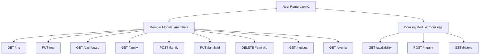

# SSPV Mandala Portal API Specification

This document defines the final REST API contract for the **Member Portal** and **Booking Inquiry** modules developed under **Milestone 4**.

---

## 🔒 1. Base Security & Authentication

Every API call (unless specified otherwise) requires a valid JSON Web Token (JWT) supplied in the HTTP Authorization header:
```http
Authorization: Bearer <JWT_ACCESS_TOKEN>
```
* **Role Controls**: Members are restricted to accessing their own records. Admins can audit and manage any member's data by passing the optional `user_id` query parameter where supported.

---

## 🛣️ 2. API Router Layout



---

## 👤 3. Member APIs

### 1. GET Profile
* **Endpoint**: `GET /api/v1/members/me`
* **Purpose**: Fetch the logged-in member's profile bio data.
* **Authentication**: Required (Member / Admin).
* **Query Parameters**:
  * `user_id` (Integer, Optional, Admin only): Target member user ID.
* **Request Body**: None.
* **Response Model (`MemberProfileResponse`)**:
  ```json
  {
    "full_name": "System Administrator",
    "village": "SSPV Mandala",
    "address": "Admin Office Headquarters",
    "mobile": "9999999999",
    "id": 1,
    "user_id": 1,
    "is_verified": true,
    "email": "admin@example.com"
  }
  ```
* **Frontend Consumer**: `MemberPortal.tsx` (Dashboard Profile overview card).

### 2. UPDATE Profile
* **Endpoint**: `PUT /api/v1/members/me`
* **Purpose**: Update the member's profile details.
* **Authentication**: Required (Member / Admin).
* **Query Parameters**:
  * `user_id` (Integer, Optional, Admin only): Target member user ID.
* **Request Body (`MemberProfileUpdate`)**:
  ```json
  {
    "full_name": "Updated System Admin",
    "village": "New SSPV Village",
    "address": "New Office HQ",
    "mobile": "9876543210"
  }
  ```
* **Response Model (`MemberProfileResponse`)**:
  *(Returns the updated profile object)*
* **Frontend Consumer**: `MemberPortal.tsx` (Edit Profile panel form).

### 3. GET Dashboard Summary
* **Endpoint**: `GET /api/v1/members/dashboard`
* **Purpose**: Fetches landing page profile details, statistics, notices, next event, and next reservation inquiry in a single request.
* **Authentication**: Required (Member / Admin).
* **Query Parameters**:
  * `user_id` (Integer, Optional, Admin only): Target member user ID.
* **Request Body**: None.
* **Response Model (`MemberDashboardSummary`)**:
  ```json
  {
    "profile": {
      "full_name": "System Administrator",
      "village": "SSPV Mandala",
      "address": "Admin Office Headquarters",
      "mobile": "9999999999",
      "id": 1,
      "user_id": 1,
      "is_verified": true,
      "email": "admin@example.com"
    },
    "statistics": {
      "family_members_count": 0,
      "pending_inquiries_count": 1,
      "approved_inquiries_count": 0,
      "active_notices_count": 0,
      "upcoming_events_count": 0
    },
    "latest_notice": null,
    "next_event": null,
    "next_booking_inquiry": {
      "contact_name": "System Administrator",
      "contact_phone": "9999999999",
      "booking_date": "2026-10-10",
      "status": "pending",
      "purpose": "Community festival ceremony",
      "hall": "Main Hall A",
      "event_name": "Annual SSPV Celebration",
      "booking_type": "member",
      "member_count": 200,
      "id": 1,
      "profile_id": 1,
      "admin_remark": null,
      "created_at": "2026-07-03T18:17:33",
      "updated_at": "2026-07-03T18:17:33"
    }
  }
  ```
* **Frontend Consumer**: `MemberPortal.tsx` (Dashboard home landing screen).

### 4. GET Family Members
* **Endpoint**: `GET /api/v1/members/family`
* **Purpose**: Retrieve the list of active family members.
* **Authentication**: Required (Member / Admin).
* **Query Parameters**:
  * `user_id` (Integer, Optional, Admin only): Target member user ID.
  * `skip` (Integer, Default: `0`, ge: `0`): Pagination offset.
  * `limit` (Integer, Default: `100`, ge: `1`): Pagination limit.
* **Request Body**: None.
* **Response Model (`List[FamilyMemberResponse]`)**:
  ```json
  [
    {
      "name": "Jane Doe",
      "relation": "Spouse",
      "age": 35,
      "education": "Bachelors",
      "occupation": "Engineer",
      "id": 1,
      "profile_id": 1
    }
  ]
  ```
* **Frontend Consumer**: `MemberPortal.tsx` (Family Directory grid).

### 5. CREATE Family Member
* **Endpoint**: `POST /api/v1/members/family`
* **Purpose**: Add a new family relative under the member's profile.
* **Authentication**: Required (Member / Admin).
* **Query Parameters**:
  * `user_id` (Integer, Optional, Admin only): Target member user ID.
* **Request Body (`FamilyMemberCreate`)**:
  ```json
  {
    "name": "Jane Doe",
    "relation": "Spouse",
    "age": 35,
    "education": "Bachelors",
    "occupation": "Engineer"
  }
  ```
* **Response Model (`FamilyMemberResponse`)**:
  *(Returns the newly created family member)*
* **Frontend Consumer**: `MemberPortal.tsx` (Add Family modal form).

### 6. UPDATE Family Member
* **Endpoint**: `PUT /api/v1/members/family/{id}`
* **Purpose**: Modify an existing family relative record.
* **Authentication**: Required (Member / Admin).
* **Request Body (`FamilyMemberUpdate`)**:
  ```json
  {
    "name": "Jane Doe Updated",
    "age": 36
  }
  ```
* **Response Model (`FamilyMemberResponse`)**:
  *(Returns the updated family member)*
* **Frontend Consumer**: `MemberPortal.tsx` (Edit Family modal form).

### 7. DELETE Family Member
* **Endpoint**: `DELETE /api/v1/members/family/{id}`
* **Purpose**: Soft-delete a family relative.
* **Authentication**: Required (Member / Admin).
* **Request Body**: None.
* **Response Model**: `204 No Content` (Empty response body).
* **Frontend Consumer**: `MemberPortal.tsx` (Delete Family relative action).

### 8. GET Notices
* **Endpoint**: `GET /api/v1/members/notices`
* **Purpose**: Fetch active community announcements and pinned board notices.
* **Authentication**: Required (Member / Admin).
* **Query Parameters**:
  * `skip` (Integer, Default: `0`, ge: `0`): Pagination offset.
  * `limit` (Integer, Default: `100`, ge: `1`): Pagination limit.
* **Request Body**: None.
* **Response Model (`List[NoticeResponse]`)**:
  *(Returns announcements list)*
* **Frontend Consumer**: `MemberPortal.tsx` (Dashboard Announcements panel).

### 9. GET Events
* **Endpoint**: `GET /api/v1/members/events`
* **Purpose**: Fetch published upcoming community calendar events.
* **Authentication**: Required (Member / Admin).
* **Query Parameters**:
  * `skip` (Integer, Default: `0`, ge: `0`): Pagination offset.
  * `limit` (Integer, Default: `100`, ge: `1`): Pagination limit.
* **Request Body**: None.
* **Response Model (`List[EventResponse]`)**:
  *(Returns upcoming events calendar list)*
* **Frontend Consumer**: `Events.tsx` (Community events listings board).

---

## 🏛️ 4. Booking Inquiry APIs

### 1. Check Hall Availability
* **Endpoint**: `GET /api/v1/bookings/availability`
* **Purpose**: Checks if a hall is already booked for a target date (filtering only by approved/non-deleted bookings).
* **Authentication**: Required (Member / Admin).
* **Query Parameters**:
  * `date` (Date, Required): Format `YYYY-MM-DD`.
  * `hall` (String, Required): Name of the hall.
* **Request Body**: None.
* **Response Model**:
  ```json
  {
    "available": true
  }
  ```
* **Frontend Consumer**: `Booking.tsx` (Availability checking calendar picker).

### 2. Submit Booking Inquiry
* **Endpoint**: `POST /api/v1/bookings/inquiry`
* **Purpose**: Submit a new hall booking inquiry request. Users cannot confirm bookings or make online payments.
* **Authentication**: Required (Member / Admin).
* **Query Parameters**:
  * `user_id` (Integer, Optional, Admin only): Submit inquiry on behalf of target user ID.
* **Request Body (`BookingInquiryCreate`)**:
  ```json
  {
    "contact_name": "System Administrator",
    "contact_phone": "9999999999",
    "booking_date": "2026-10-10",
    "purpose": "Community festival ceremony",
    "hall": "Main Hall A",
    "event_name": "Annual SSPV Celebration",
    "member_count": 200
  }
  ```
* **Response Model (`BookingInquiryResponse` - Financial Fields Removed)**:
  - Initial `status` is forced to `"pending"`.
  ```json
  {
    "contact_name": "System Administrator",
    "contact_phone": "9999999999",
    "booking_date": "2026-10-10",
    "status": "pending",
    "purpose": "Community festival ceremony",
    "hall": "Main Hall A",
    "event_name": "Annual SSPV Celebration",
    "booking_type": "member",
    "member_count": 200,
    "id": 1,
    "profile_id": 1,
    "admin_remark": null,
    "created_at": "2026-07-03T18:17:33",
    "updated_at": "2026-07-03T18:17:33"
  }
  ```
* **Frontend Consumer**: `Booking.tsx` (Inquiry submit form button).

### 3. GET Booking Inquiry History
* **Endpoint**: `GET /api/v1/bookings/history`
* **Purpose**: Retrieve the list of active booking inquiries registered under the profile.
* **Authentication**: Required (Member / Admin).
* **Query Parameters**:
  * `user_id` (Integer, Optional, Admin only): Target member user ID.
  * `status` (String, Optional): Filter by status (`pending`, `approved`, `rejected`).
  * `sort_by` (String, Default: `booking_date`): Field to sort by (`booking_date`, `created_at`).
  * `order` (String, Default: `desc`): Sorting direction (`asc` or `desc`).
  * `skip` (Integer, Default: `0`, ge: `0`): Pagination offset.
  * `limit` (Integer, Default: `100`, ge: `1`): Pagination limit.
* **Request Body**: None.
* **Response Model (`List[BookingInquiryResponse]`)**:
  *(Returns inquiries list, with `amount` and `payment_status` fields omitted)*
* **Frontend Consumer**: `Booking.tsx` / `History.tsx` (Inquiries listing history).

---

## 👑 5. Future Admin-Only APIs (Placeholder Blueprint)
The following administrative fields are present in the underlying SQL database but are **NOT** exposed to member-facing routers. They will be utilized in future Admin-Only APIs:
* **Financial Auditing Fields**:
  - `amount` (Numeric(10,2))
  - `payment_status` (String: `"pending"`, `"paid"`, `"refunded"`)
* **Inquiry Modification Route**:
  - `PUT /api/v1/admin/bookings/{id}/review`: Accepts status updates (`"approved"`, `"rejected"`), records offline payment details, updates pricing quotes, and registers administrative remarks.
